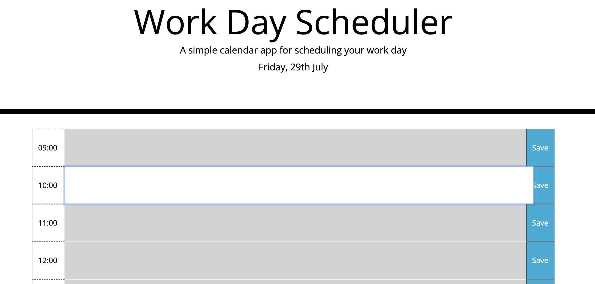

# Day Planner
Website to enter events during work hours and save the evens for future review

## Links to the webpage and repository

To access the website use [Day Planner](https://haruka08.github.io/Harukas-Portfolio/)

To access the GitHub repository use [GitHub Repository Day Planner](https://github.com/Haruka08/Harukas-Portfolio)

## Content

1. At the top of the page there is an area showing the date with the current time.

2. The planner consists of work hours listed on the left hand side of the list between 9am to 5pm.

3. The mid section of the planner allows the user to enter information

4. The right hand side button saves the use input on to the local storage.

5. When the user input is save, a message appears at the top of the list confirming that the data has been saved. 

6. When the page is refreshed, the information remains on the page.

## Screenshot of the modified website

